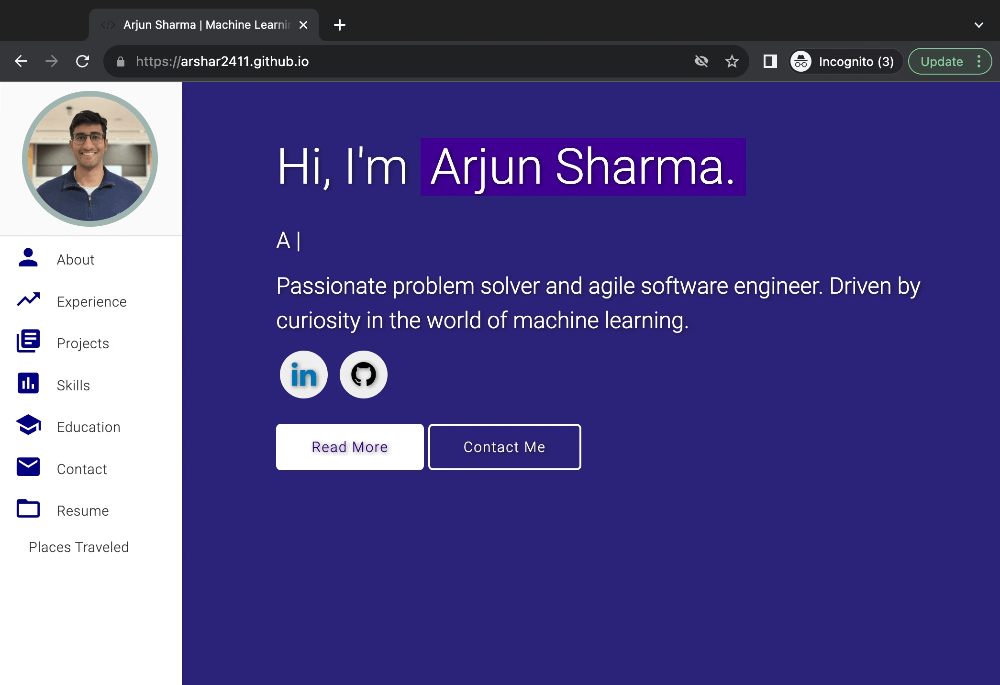

# Arjun's Personal Portfolio ⚡️ 
> This repo is a clone of https://varadbhogayata.github.io by Varad Bhogayata

> A clean, beautiful, responsive portfolio template for Software Developers!

> https://arshar2411.github.io

 

### Website Preview

 
  <kbd>
    
  </kbd>

:star: Star me on GitHub — it helps!

## License 📄
This project is licensed under the MIT License - see the [LICENSE.md](./LICENSE) file for details.
